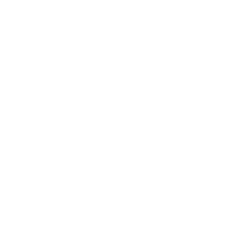

    
    <h1>Pinpoint Website</h1>
    
 The official website repository for the Pinpoint Website. 

<h2> How to run it? </h2>

 First of all, you need <code>pnpm</code>. To install <code>pnpm</code>, just do <code>npm install -g pnpm</code> and make sure you have NodeJS installed. 

 Next, you're gonna have to clone the repository and navigate in. Once you're in, do <code>pnpm install</code>, and then do <code>pnpm dev</code>. This will run the server in <code>localhost:5173</code>. 

<h2> How to build it? </h2>

 Same folder again, but run <code>pnpm build</code>. Which will trigger vite's build process and compiles it all to one folder, ready to use. 

 Once it's done downloading, check it first by doing <code>pnpm preview</code> and going to a browser with URL <code>localhost:4173</code>. 

